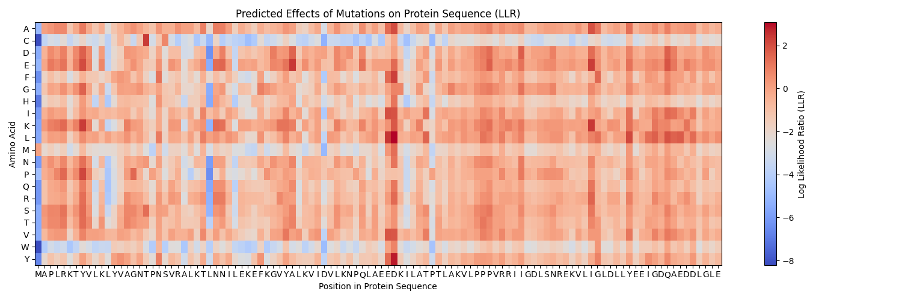

# Variant Effects with Protein and DNA Language Models

This repo contains several scripts for assessing the effects of single point mutations and pairs of mutations on protein sequences and DNA sequences using the HuggingFace Transformers library. We use the protein language model ESM-2 for proteins, and the DNA language models Caduceus or Evo for DNA. This expands on the methods used in the folowing three papers,

- [Genome-wide prediction of disease variant effects with a deep protein language model](https://www.nature.com/articles/s41588-023-01465-0)
- [Caduceus: Bi-Directional Equivariant Long-Range DNA Sequence Modeling](https://arxiv.org/abs/2403.03234)
- [Sequence modeling and design from molecular to genome scale with Evo](https://www.biorxiv.org/content/10.1101/2024.02.27.582234v1)

for predicting variant effects. 

## Install

First, clone the repository:
```
git clone https://github.com/amelie-iska/Variant-Effects.git
```

A modification of the Caduceus conda environment is used here. This is not strictly necessary as all models are run through the transformers library. So feel free to set up a simpler environment. Additionally, we plan to add a third, newer DNA language model once it is trained. 

1. To begin, clone the repo. 
2. Run the following to set up your conda or mamba environment:
```bash
cd Variant-Effects
```
```bash
conda env create -f caduceus.yml
```
3. Activate the environment:
```bash
conda activate caduceus
```
4. Next, run:
```bash
pip install -r requirements.txt
```

## How it Works

1. Tokenization:

The code begins by importing necessary libraries, loading the pretrained ESM-2 or Caduceus model and tokenizer, and specifying the input protein or DNA sequence. The sequence is tokenized using the tokenizer, resulting in a sequence of token IDs. Each amino acid in the protein sequence is mapped to a corresponding token using the tokenizer's vocabulary.

2. LLR Calculation:

For each position `p` along the protein sequence, LLRs are calculated for each of the 20 standard amino acids. Let `i` represent the index of an amino acid variant in the list of amino acids. The LLR for amino acid substitution `i` at position `p` is given by:

$$ LLR_{i,p} = \log\left(\frac{P_{i,p}}{P_{\text{wt},p}}\right) $$

where:

$$ P_{i,p} $$

is the probability of observing amino acid `i` at position `p`.

$$ P_{\text{wt},p} $$

is the probability of observing the wild-type amino acid at position `p`.
 
3. Model Inference:

At each position `p`, the target amino acid is masked, and the model is used to predict the probability distribution of amino acid tokens at that position. The logits output by the model for each amino acid token are transformed into probabilities using the softmax function:

$$ P_{i,p} = \text{softmax}\left(\text{logits}_{i,p}\right) $$

4. Log Probability Calculation:

The predicted probabilities are then used to calculate the log probabilities:

$$ \log P_{i,p} = \log\left(\text{softmax}\left(\text{logits}_{i,p}\right)\right) $$

5. LLR Calculation for Wild-Type:

The log probability of the wild-type amino acid at position `p`, denoted as \\( log P_{wt, p}\\), is retrieved from the log probability tensor.

6. LLR Calculation for Variant Amino Acids:

The log probability of amino acid variant `i` at position `p`, denoted as \\( \log P_{i, p}\\), is calculated similarly.

7. All pairs of LLR values from distinct columns of the heatmap are summed and the sums are ranked. Then the top ten and lowest ten sums, along with the corresponding pairs of mutations, are returned to predict which pairs of mutations are likely the most and least beneficial to the functioning of the protein or DNA sequence. 

## Compute LLR Heatmap and Mutation Pair Effects for a Single Protein or DNA Sequence

The Mamba-SSM architecture (Caduceus) is much more efficient computationally than transformers (ESM-2). This enables much larger context windows for Caduceus than for ESM-2, which means you may input DNA sequences up to 131,000 bases in length. However, computing the sums of all pairs of LLR values from different columns of the heatmap (corresponding to distinct pairs of residues) can make the computation slow. 

Use the script `./scripts/protein_mutation_pairs_effects.py` or `./scripts/dna_mutation_pairs_effects.py` to run on single sequences. This will return heatmaps like the following:




 
Use `./scripts/protein_mut-pairs_uniprot.py` to run on protein sequences from the [UniProt database](https://www.uniprot.org/) using the protein name as input (ex: `BRCA1`).

Use `./scripts/dna_mut-pairs_ensembl.py` to run on DNA sequences from the [Ensembl database](https://useast.ensembl.org/index.html) using the DNA sequence's name as input (ex: `ENSG00000157764`). 


## Compute LLR Heatmap and Mutation Pair Effects for Multiple Protein or DNA Sequences with a FASTA Input File

To run predictions on multiple protein or DNA sequences stored in a FASTA file, use something like the following commands. 

### For Proteins

```bash
python ./scripts/protein_mutation_pairs_fasta.py --interval [1-100] \
    --model_name facebook/esm2_t6_8M_UR50D \
    --fasta_file "./data/O95905-ecd_human.fa" \
    --mutation_effects_output "./outputs/protein_mutation_effects.csv" \
    --pair_effects_output "./outputs/protein_pair_effects.csv"
```
The models you can choose from are:
- `facebook/esm2_t6_8M_UR50D`, 
- `facebook/esm2_t12_35M_UR50D`, 
- `facebook/esm2_t30_150M_UR50D`, 
- `facebook/esm2_t33_650M_UR50D`, 
- `facebook/esm2_t36_3B_UR50D`, 
- `facebook/esm2_t48_15B_UR50D`

These can all be found on [HuggingFace here](https://huggingface.co/facebook/esm2_t6_8M_UR50D). 

### For DNA

```bash
python ./scripts/dna_mutation_pairs_fasta.py --interval [1-100] \
    --fasta_file "./data/Homo_sapiens_BRAF_sequence.fa" \
    --mutation_effects_output "./outputs/dna_mutation_effects.csv" \
    --pair_effects_output "./outputs/dna_pair_effects.csv"
```

The LLR heatmaps will be saved as a CSV to the location specified in the `--mutation_effects_output` flag, and the mutation pairs with the highest and lowest ten sums will be saved to the location specified by the `--pair_effects_output` flag.

This model can be found on [HuggingFace here](https://huggingface.co/collections/kuleshov-group/caduceus-65dcb89b4f54e416ef61c350). The codebase can easily be adapted so that other versions of Caduceus can be used, but we currently only use the [most performant model](https://huggingface.co/kuleshov-group/caduceus-ps_seqlen-131k_d_model-256_n_layer-16). 

## Using Evo
You can now also use the "causal" or autoregressive DNA language model [Evo](https://github.com/evo-design/evo) now as well. Some care is recommended as some mistakes were found with Evo where incorrect permutations of some projections are computed. This is supposed to have been fixed in [this version on HuggingFace](https://huggingface.co/togethercomputer/evo-1-131k-base), which is what we use here. For single sequences, you can run: 

```bash
python ./scripts/evo_mutation_pairs_effects.py --model togethercomputer/evo-1-131k-base \
    --dna-seq ATGCATGCATGCATGCATGCATGCATGCATGCATGCATGCATGCATGCATGCATGCATGCATGCATGCATGCATGCATGCATGCATGCATGCATGCATGCATGCATGC \ 
    --output-filename ./outputs/evo_heatmap.png
```

or, for multiple sequences you can run:

```bash
python ./scripts/evo_mutation_pairs_fasta.py --interval [1-100] \ 
    --fasta_file "./data/Homo_sapiens_BRAF_sequence.fa" \ 
    --mutation_effects_output "./outputs/evo_mutation_effects.csv" \ 
    --pair_effects_output "./outputs/evo_pair_effects.csv" \ 
    --model togethercomputer/evo-1-131k-base
```
Depending on your GPU, you may also want to use the smaller `togethercomputer/evo-1-8k-base` model.  

## Other Mutation Scoring Methods

In [Language models enable zero-shot prediction of the effects of mutations on protein function](https://www.biorxiv.org/content/10.1101/2021.07.09.450648v2) several additional methods for scoring multiple mutations of a protein sequence were defined. Namely, the "masked-marginal", "wild-type marginal", and "pseudo-perplexity" were compared to one another. It appears as though the masked-marginal scoring method performed best, but here again, [the original implementation](https://github.com/facebookresearch/esm/blob/main/examples/variant-prediction/predict.py) may have errors. Here we provide versions of this script for use with ESM-2 and Caduceus but it is advised that you check for errors in the implementation. These scoring methods are intended to be slightly more robust at predicting the effects of multiple (simultaneous) epistatic mutations on a protein (with ESM-2) or on a DNA sequence (with Caduceus), but some of them may be more computationally expensive and slower. 

### For Proteins
To run on a protein sequence use:
```bash
python3 ./scripts/protein_mutation_scoring.py --model "facebook/esm2_t12_35M_UR50D" \
    --sequence "MKTIIALSYIFCLVFA" \
    --dms-input ./data/protein_dms.csv \
    --dms-output ./outputs/protein_masked-marginal.csv \
    --mutation-col mutant \
    --scoring-strategy masked-marginals
```

### For DNA
To run on a DNA sequence use:
```bash
python3 ./scripts/dna_mutation_scoring.py --sequence "AGTCAGTCAAATCGCAGCTGACTATCGATC" \
    --dms-input ./data/dna_dms.csv \
    --dms-output ./outputs/dna_masked-marginal.csv \
    --mutation-col mutant \
    --scoring-strategy masked-marginals
```
